# UTRAINS : CI/CD for Spring Boot applications using GitHub Actions and AWS

## Lab Description.
In our company, we have a team of developers who have created a Java Application with the SpringBoot framework. The application in question allows to do the following actions: 

* Get random nations
* Get random currencies
* Get application version
* health check

So the company wants to operationalize and automate the development and deployment of this application.  As a student enrolled in the training courses at Utrains, the company would like your support to accomplish this mission.


The Team Lead of the developer team gives you the following information: 
1- We use __java 11.0.14__ to compile our SpringBoot application;
2- We use __Apache Maven 3.8.4__ to build the project
3- We use a __Github__ repository to manage the versioning of our source codes
4- We use Sonar to analyze and improve the quality of our source code
5- we use __JUnit 5__, a java framework for unit testing
6- To finish building our application, we want :
* as soon as the developers make a push on the main branch, the application is built, 
* the unit tests are executed, and if everything is correct,
* __sonar__ analysis is performed and the results on the quality of the code are recorded in __Sonarcloud.__
* a continuous deployment must be done on __Aws Elastic Beanstalk__

# Solution
## Notes: We are going to make these tasks for pedagogical purposes so that the student can improve it or use it as a project.

## The steps to carry out these tasks are : 
#### step 1: preparation of the environment
#### step 2 : GitHub Actions first Job (Unit Test)
#### step 3 : SonarCloud job
#### step 4 : Build job
#### step 5 : AWS Elastic Beanstalk Job
#### step 5 : Test RESTFULL services with Postman

# step 1: preparation of the environment
### goal : to have the source codes of the developers in a personal repository

- create a personal repository in GitHub. in my case I create the repository cicd_lab_springBoot

- clone your git repository in your machine locate. open the terminal and make these commands line.
```sh
git clone git@github.com:utrains/cicd_lab_springBoot.gitc
```

- enter the local github repository and copy the source codes of our SpringBoot application. these codes are in one of the Utrains server 
```sh
cd cicd_lab_springBoot
scp -r serge@unixtrainings.tk:/home/serge/SpringBootApp/* .
password: "please Prof. give the password to the students"
ls
```
with the ```ls``` command, you can see the content of the source code file in the image below. 
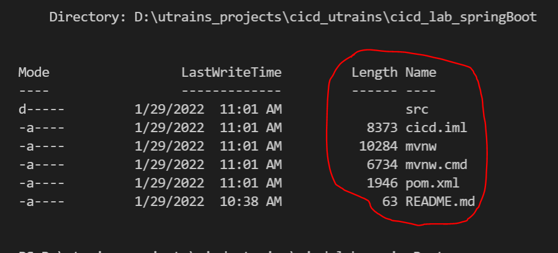

The source code of the application on which you want to automate the CI/CD is currently in your local repository.

# step 2 : GitHub Actions first Job (Unit Test). 
We will now create our first Job. To do so, we need to create a yml file in the directory __(.github/workflows/build.yml)__ and then add the content below. For more understanding, read the comments in this file to understand the why and how. 

```sh
code .github/workflows/build.yml
```
#### Content of the file : .github/workflows/build.yml

```name: CI/CD Pipeline
on:
  #Manually trigger workflow runs
  workflow_dispatch:
  #Trigger the workflow on push from the main branch
  push:
    branches:
      - main
jobs:
  #Test's job
  tests:
    name: Unit tests
    #Run on Ubuntu using the latest version
    runs-on: ubuntu-latest
    #Job's steps
    steps:
      #Check-out your repository under $GITHUB_WORKSPACE, so your workflow can access it
      - uses: actions/checkout@v1
      #Set up JDK 11
      - name: Set up JDK
        uses: actions/setup-java@v1
        with:
          java-version: '11'
      #Set up Maven cache
      - name: Cache Maven packages
        #This action allows caching dependencies and build outputs to improve workflow execution time.
        uses: actions/cache@v1
        with:
          path: ~/.m2
          key: ${{ runner.os }}-m2-${{ hashFiles('**/pom.xml') }}
          restore-keys: ${{ runner.os }}-m2
      #Run Tests
      - name: Run Tests
        run: mvn -B test
```
- In the above file, we have a pipeline called CI/CD Pipeline, it will be triggered manually or when it detects a push on the main branch.
- This pipeline contains a single job called testswith a name label Unit tests, this job contains several steps. 
- First, it will set up the JDK 11 then it will set up the maven cache and finally it will run the application tests.

### Now let’s test our pipeline and see what will happen : commit and push your repository to GitHub.
```sh
git add --all
git commit -m "CI/CD pipeline : Test's Job"
git push origin main
```

* Now go to your Github repository and click on Actions. You will find the pipeline’s status and the steps logs.

* We have circled in red in the pictures to show you how your first job works :

## 1. click on the repository in github then on the __Action__ tab to see the result.

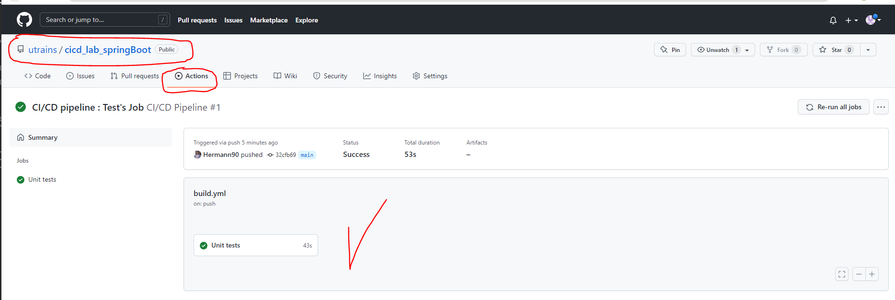

## 2. click on the no of the pipeline to derive it;

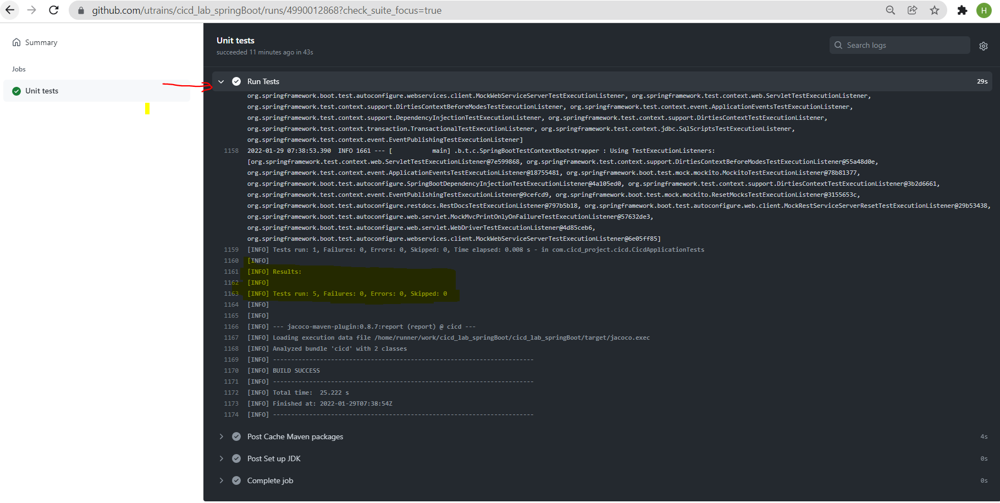

## 3. click on the __Run Test__ step to see that the 5 tests in our source code have been executed soon;


### Cool, everything works fine 💪.
You can also run the pipeline manually at any time 😉.

* Now let’s move on to the next step in which we add sonar analysis to our pipeline 😎.

# step 3 : SonarCloud job

- SonarCloud is the leading online service to catch Bugs and Security Vulnerabilities in your code repositories.

- in this step, we will click on the sonarcloud link, create an account if we don't have one already, then select our repository for some configuration. 

## 1. open the sonarcloud link by clicking  on this link

[SonarCloud.](https://sonarcloud.io/)

## 2. click on GitHub buton in this image.

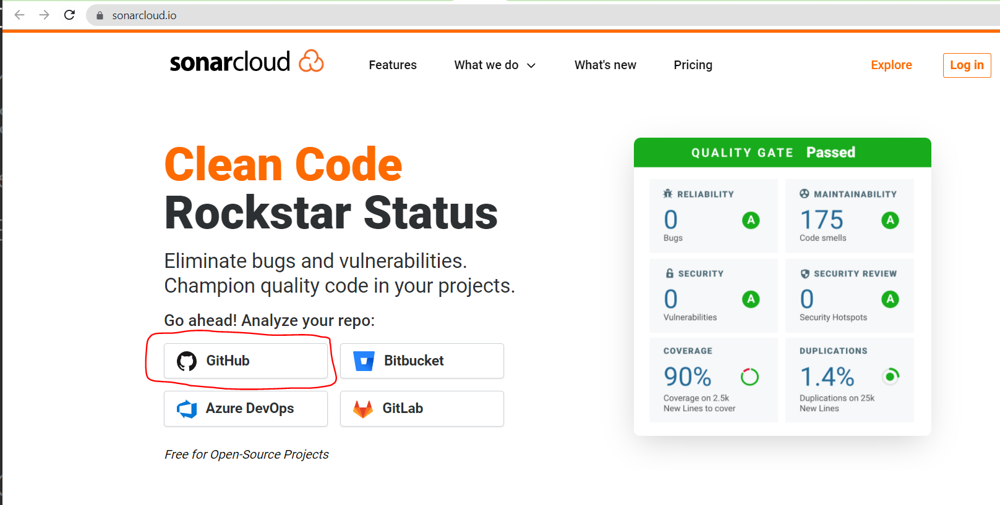

## 3. authorize Sonar to access your Github account, by clicking on the button below.

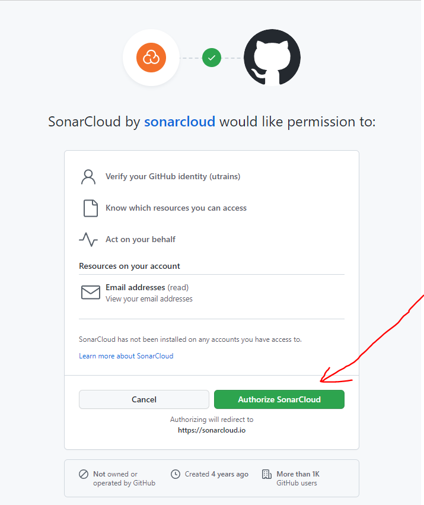

## 4. click on __Import an organization from GitHub__ to create an organization in SonarCloud.

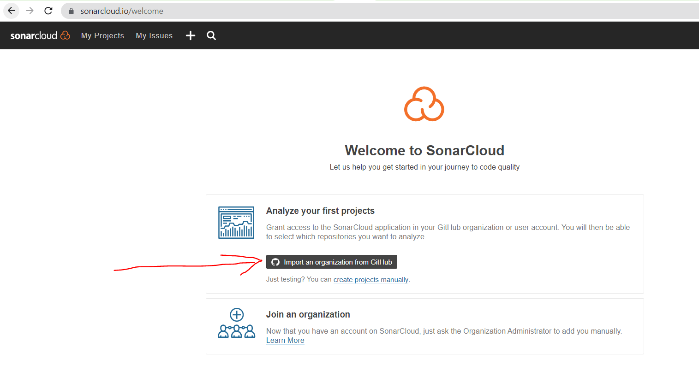

## 5. Here, check in 1, in 2 click then select the deposit you have created. Then in 3 click on the __Install__ button to configure your repository.

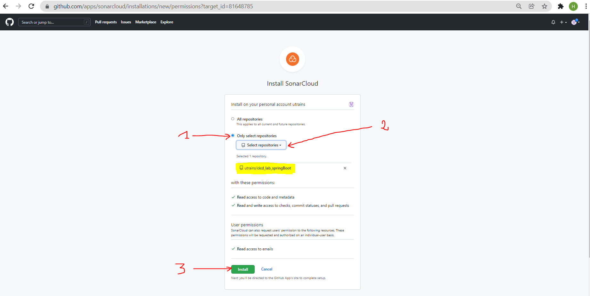

## 6. Enter your GitHub password and validate

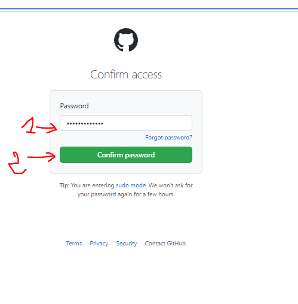

## 7. fill in a key for the organization then click on __continue__
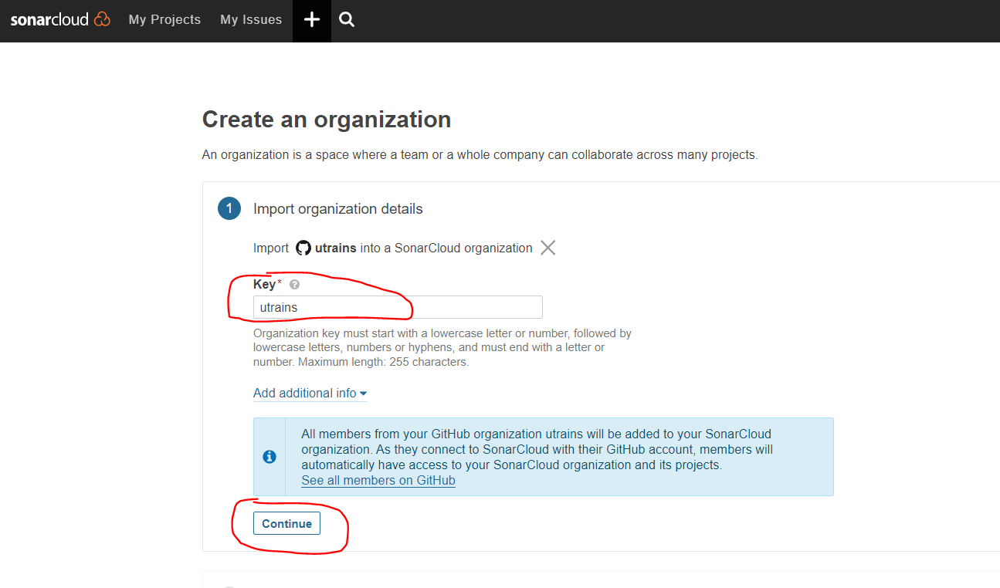

## 8. select the free plan, then click on the __Create Organization__ button to create your sonar organization

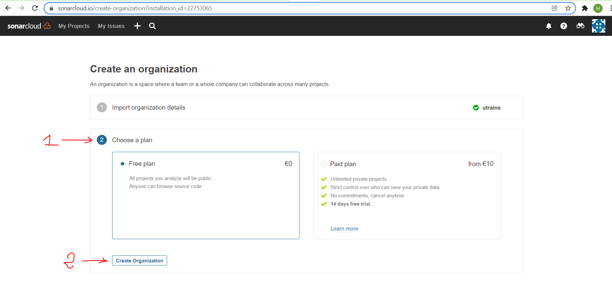

## 9. click on __Create New Project__.

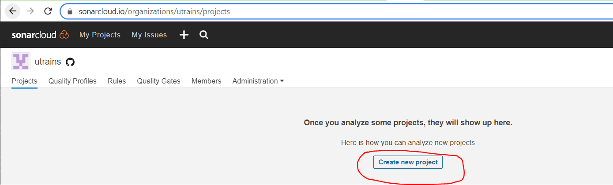

## 10. Select your deposit in 1 then in 2 click on the __Set Up__ button to configure it

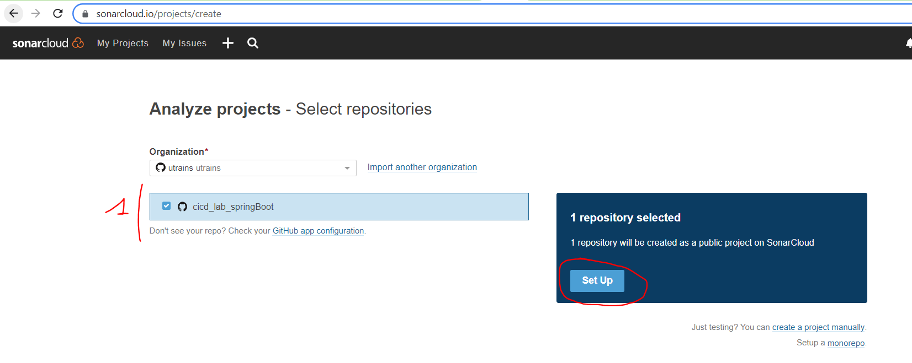

## 11. click in 1 to choose to configure __With GitHub Actions__

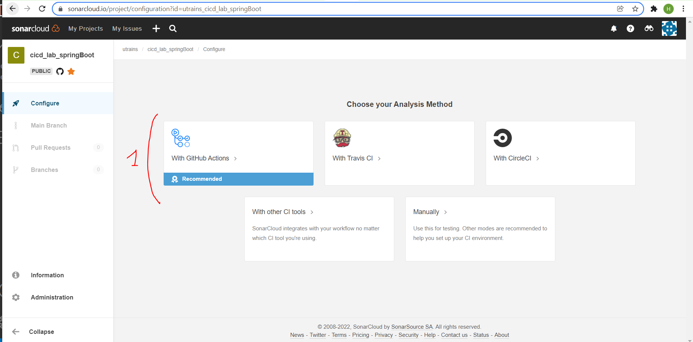

## 12. We have the security information (token) that will allow GitHub to send the source code to SonarCloud for analysis. At this step, we will go to a tab where GitHub is located to put this information. Then we will return to this window and click on __continue__

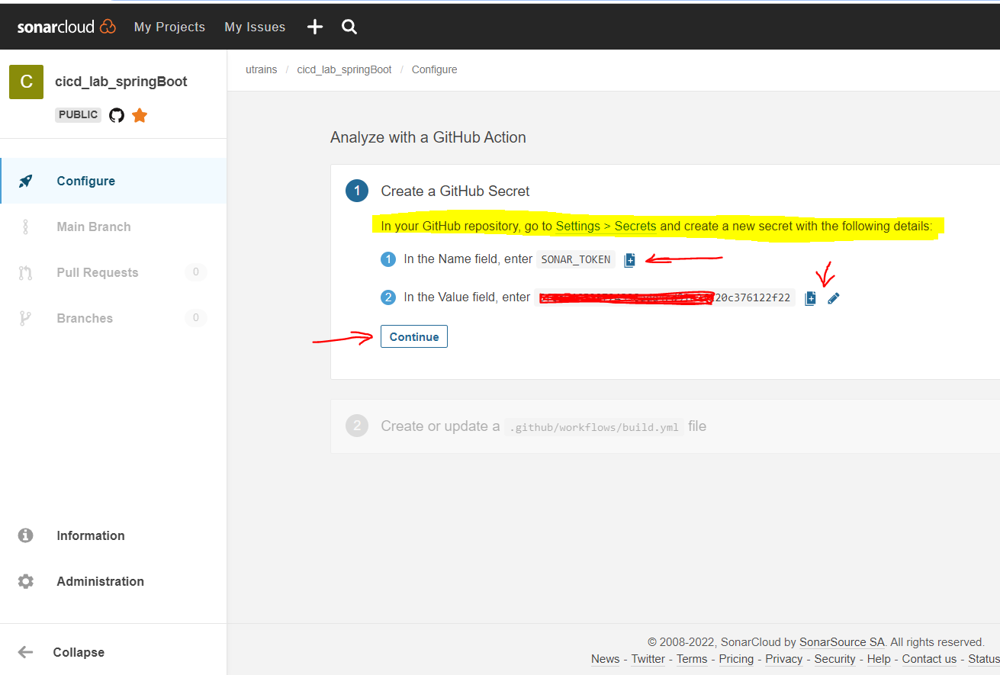

## 13. In GitHub, select your repository, click on the Setting tab. Select in 1 under the __Secrets__ tab the __Actions__ tab then in 2 to enter the sonarcloud token

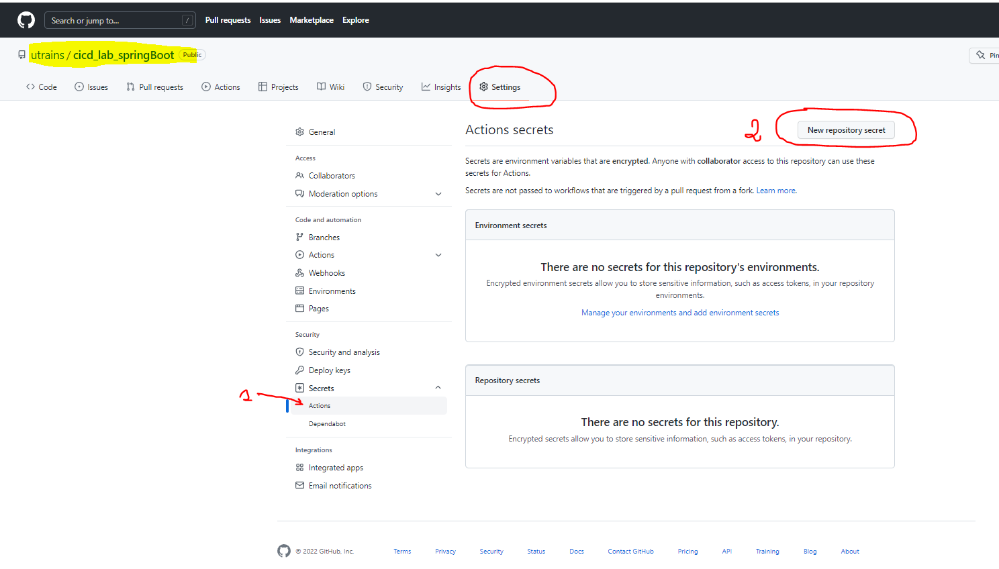

## 14. enter the name and value of the secret you have in your SonarCloud (step 12.)

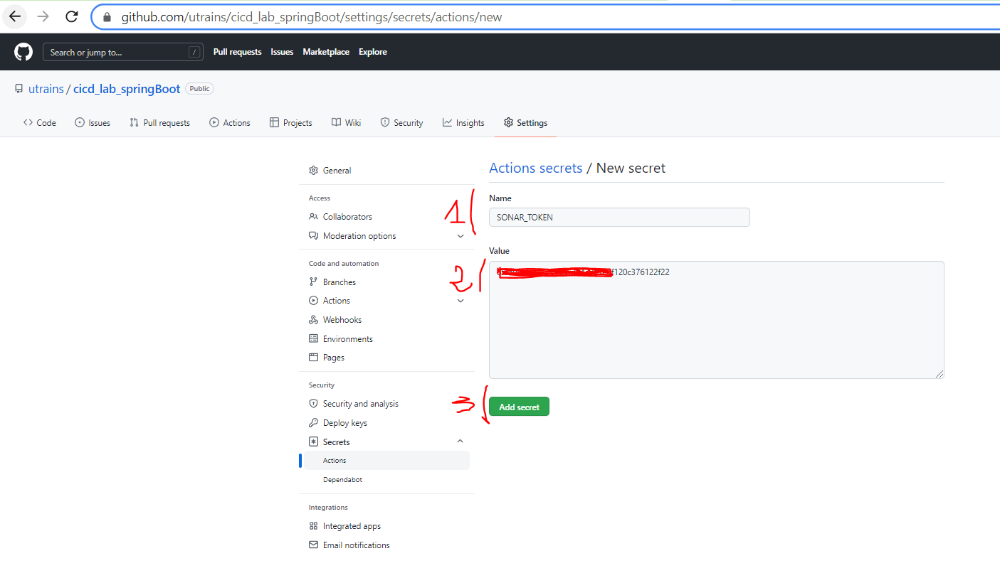

## 15. you can see the Secrets that you have created

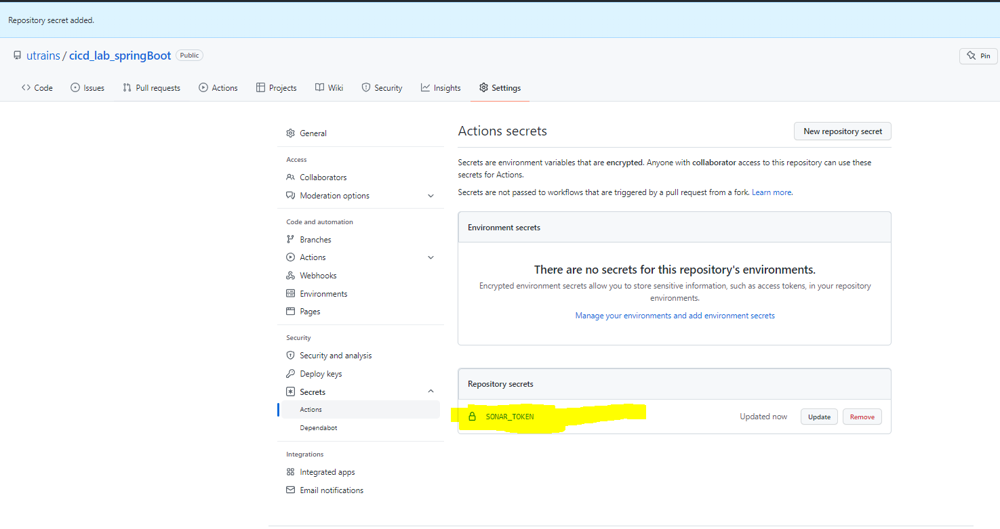

## 16. Return to the tab where Sonar Cloud is located, then click Continue. The window that appears gives a set of lines of code that we can add to our build.yml file to create a Job for Sonr analysis in our GitHub. 

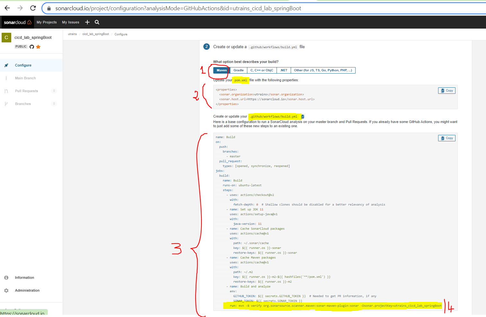

In this picture, the only line that concerns us is the last line marked in 4 :

## 17. creation of the Job for Sonar analysis:

replace the last line of this code below with your last line from the previous step. Then copy and add the code to your __build.yml__ file. 

```
############## SonarCloud Job ###############
  #Sonar's Job
  sonar:
    #Depends on test's job
    needs: tests
    name: SonarCloud analysis
    #Run on Ubuntu using the latest version
    runs-on: ubuntu-latest
    #Job's steps
    steps:
      #Check-out your repository under $GITHUB_WORKSPACE, so your workflow can access it
      - uses: actions/checkout@v1
      #Set up JDK 11
      - name: Set up JDK
        uses: actions/setup-java@v1
        with:
          java-version: '11'
      #Set up SonarCloud cache
      - name: Cache SonarCloud packages
        #This action allows caching dependencies and build outputs to improve workflow execution time.
        uses: actions/cache@v1
        with:
          path: ~/.sonar/cache
          key: ${{ runner.os }}-sonar
          restore-keys: ${{ runner.os }}-sonar
      #Set up Maven cache
      - name: Cache Maven packages
        #This action allows caching dependencies and build outputs to improve workflow execution time.
        uses: actions/cache@v1
        with:
          path: ~/.m2
          key: ${{ runner.os }}-m2-${{ hashFiles('**/pom.xml') }}
          restore-keys: ${{ runner.os }}-m2
      #Analyze project with SonarCloud
      - name: Analyze with SonarCloud
        env:
          GITHUB_TOKEN: ${{ secrets.GITHUB_TOKEN }}
          SONAR_TOKEN: ${{ secrets.SONAR_TOKEN }}
        run: mvn -B verify org.sonarsource.scanner.maven:sonar-maven-plugin:sonar -Dsonar.projectKey=utrains_cicd_lab_springBoot
```

## 18. update the pom.xml file.

open the __pom.xml__ file, then fill in the name of your project correctly in 2. Then in 2, put the name of your sonar organization that you have created in lower case.
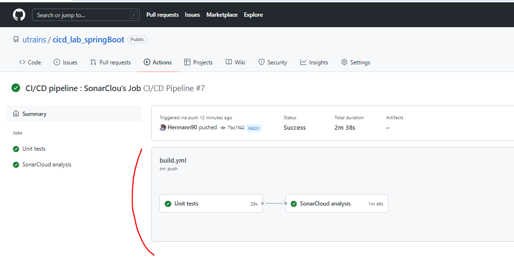


- As you can see the sonar job depend on the tests job, which means once the testsjob fail the sonar job will not be executed.

### Now let’s test our second Job and see what will happen : commit and push your repository to GitHub.
```sh
git add --all
git commit -m "CI/CD pipeline : SonarCloud's Job"
git push origin main
```

* Now go to your Github repository and click on Actions. You will find the pipeline’s status and the steps logs.


## 19. goto SonarCloud then click on your project and check the result.

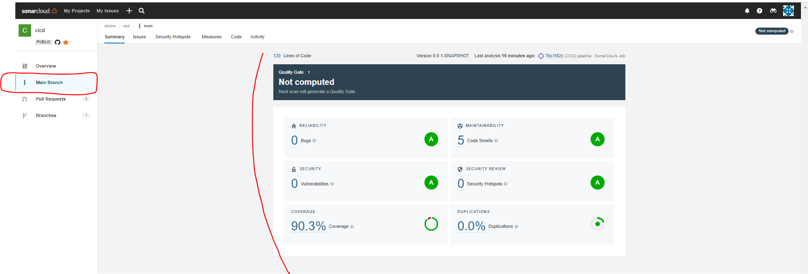

### Cool, everything works fine 💪.

After the unit test job and the sonar job, we will add another job to build our application and generate the jar file 😀.

# step 4 : Build job

* This job will build the application using maven and will upload the jar file.
* The upload artifact step allows us to share data between jobs and store data once a workflow is complete. 
* In our case, we will use the uploaded jar file in the deploy job.

#### For this task, add the following code to our build.yml file

```
############################### Build Job and Generate the Jar File for Deployment ################
  #Build's job
  build:
    #Depends on sonar's job
    needs: sonar
    name: Build
    #Run on Ubuntu using the latest version
    runs-on: ubuntu-latest
    steps:
      #Check-out your repository under $GITHUB_WORKSPACE, so your workflow can access it
      - uses: actions/checkout@v1
      #Set up JDK 11
      - name: Set up JDK
        uses: actions/setup-java@v1
        with:
          java-version: '11'
      #Set up Maven cache
      - name: Cache Maven packages
        #This action allows caching dependencies and build outputs to improve workflow execution time.
        uses: actions/cache@v1
        with:
          path: ~/.m2
          key: ${{ runner.os }}-m2-${{ hashFiles('**/pom.xml') }}
          restore-keys: ${{ runner.os }}-m2
      #Build the application using Maven
      - name: Build with Maven
        run: mvn -B package -DskipTests --file pom.xml
      #Build the application using Maven
      - name: Upload JAR
        #This uploads artifacts from your workflow allowing you to share data between jobs and store data once a workflow is complete.
        uses: actions/upload-artifact@v2
        with:
          #Set artifact name
          name: artifact
          #From this path
          path: target/data-0.0.1-SNAPSHOT.jar
```

### Now let’s commit and push your repository to GitHub.

```sh
git add --all
git commit -m "CI/CD pipeline : Build Job to generate jar file for depoy"
git push origin main
```

* Now go to your Github repository and click on Actions. You will find the pipeline’s status and the steps logs.
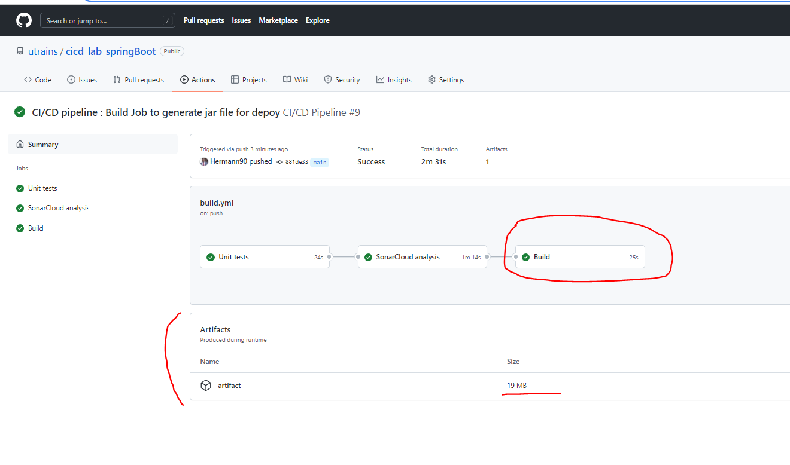

### The job has been completed 😎 😎.
You can even see the generated file in the artifacts part, you can also download it and run it on your local machine.

Now, let’s move to the last step, which is the application deployment.
For the deployment, we are going to use AWS Elastic Beanstalk.

# step 5 : AWS Elastic Beanstalk Job

* AWS Elastic Beanstalk is an easy-to-use service for deploying and scaling web applications and services.

- With Elastic Beanstalk, you can quickly deploy and manage applications in the AWS Cloud without having to learn about the infrastructure that runs those applications. 

- Elastic Beanstalk reduces management complexity without restricting choice or control. 

- You simply upload your application, and Elastic Beanstalk automatically handles the details of capacity provisioning, load balancing, scaling, and application health monitoring.

### Now let’s create our deploy environment 😊 : 
## 1. First, we need to connect to the AWS account then we select the Elastic Beanstalk service.

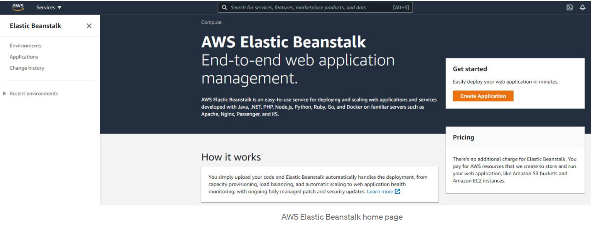

## 2. Then click on Create Application
Fill in the fields and click on create Application. 

In our case we are going to put:
-  Application name: spring-boot-deploy
- Platform: Java Corretto 11 V3.1.8
- Application code: sample application

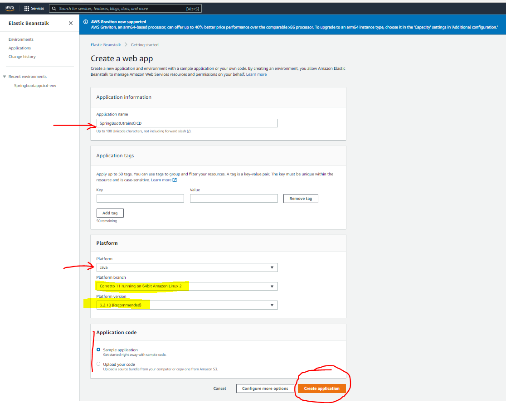
Then click Create application.
The environment creation will take a few minutes 

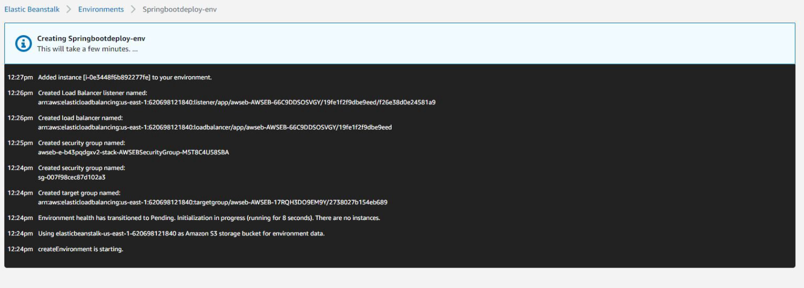

 ## 3. Once the environment is ready it will look like this

- Here we can see the web link on which the application will be deployed.
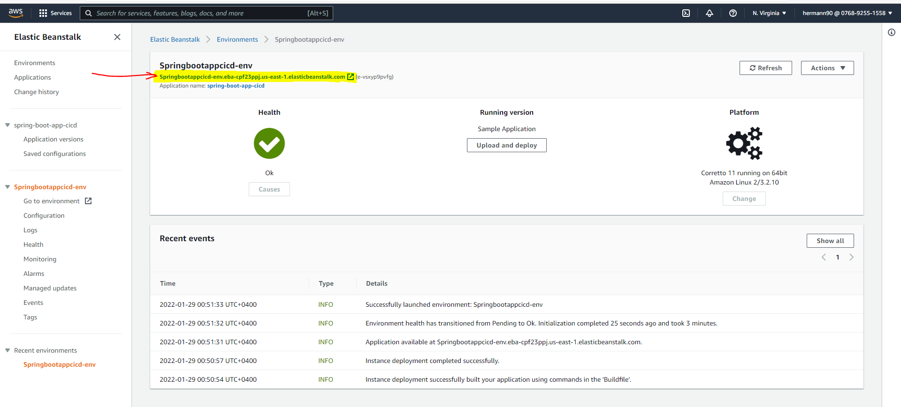

* Great, now we have an environment that is ready to use.
* As mentioned above, AWS gives us a public address to access our application from the internet.

[SpringBoot App public Address](http://springbootappcicd-env.eba-cpf23ppj.us-east-1.elasticbeanstalk.com/)

## 4. By default, the website will show you this.
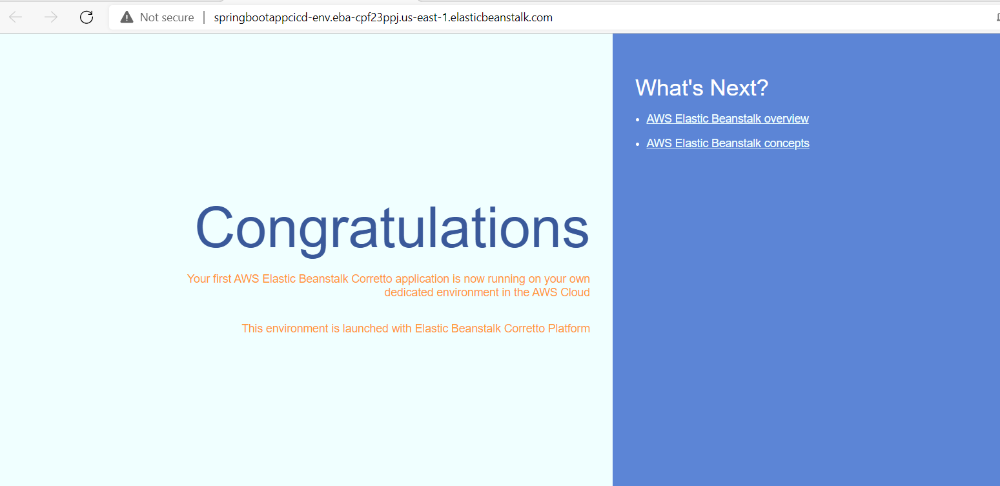

## 5. First, you need to add AWS_ACCESS_KEY_ID , AWS_SECRET_ACCESS_KEY , AWS_SESSION_TOKEN to the GitHub secrets.

To be able to generate this information and continue our configuration in GitHub, we need to : 
- configure the multi-factor authentication (MFA) in our aws account.
- install AWSCLIV2
- then use the information to generate the AWS_ACCESS_KEY_ID , AWS_SECRET_ACCESS_KEY , AWS_SESSION_TOKEN to configure our github secrets Action
    
    ### 5.1. Enable a virtual MFA device for an IAM user (console) 
      1. Sign in to the AWS Management Console and open the IAM console at
      https://console.aws.amazon.com/iam/

      2. In the navigation pane, choose __Users__.

      3. In the __User Name__ list, choose the name of the intended MFA user.

      4. Choose the __Security credentials__ tab. Next to __Assigned MFA device__, choose __Manage.__

      5. In the __Manage MFA Device__ wizard, choose __Virtual MFA device__, and then choose Continue.
      IAM generates and displays configuration information for the virtual MFA device, including a QR code graphic. The graphic is a representation of the "secret configuration key" that is available for manual entry on devices that do not support QR codes.

      6. Open your virtual MFA app. For a list of apps that you can use for hosting virtual MFA devices, see http://aws.amazon.com/iam/details/mfa/
      If the virtual MFA app supports multiple virtual MFA devices or accounts, choose the option to create a new virtual MFA device or account.
      In my case, I chose the __Authy__ application available on __play store__.

      7. Determine whether the MFA app supports QR codes, and then do one of the following:
        - From the wizard, choose __Show QR code__, and then use the app to scan the QR code. For example, you might choose the camera icon or choose an option similar to __Scan code__, and then use the device's camera to scan the code.
        - In the __Manage MFA Device__ wizard, choose __Show secret key__, and then type the secret key into your MFA app. 
        
        When you are finished, the virtual MFA device starts generating one-time passwords.

      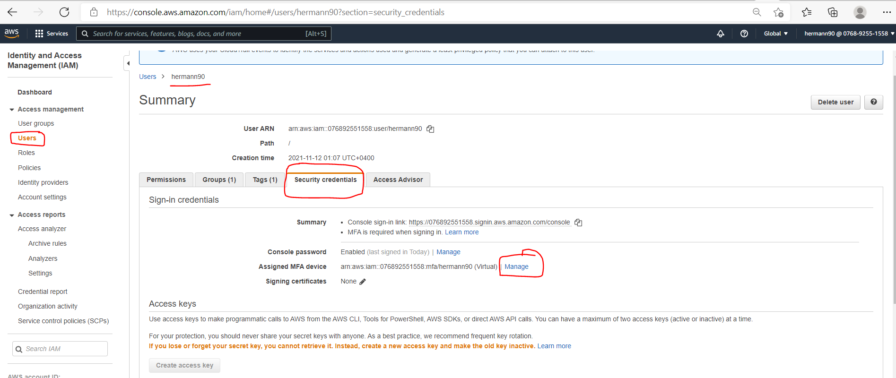

      8. In the __Manage MFA Device__ wizard, in the __MFA code 1__ box, type the one-time password that currently appears in the virtual MFA device. Wait up to 30 seconds for the device to generate a new one-time password. Then type the second one-time password into the __MFA code 2__ box. Choose __Assign MFA__.

      Note: Submit your request immediately after generating the codes. If you generate the codes and then wait too long to submit the request, the MFA device successfully associates with the user but the MFA device is out of sync. This happens because time-based one-time passwords (TOTP) expire after a short period of time. If this happens, you can [resync the device](https://docs.aws.amazon.com/IAM/latest/UserGuide/id_credentials_mfa_sync.html).

      click here [For more information on MFA configuration and even for a root user](https://docs.aws.amazon.com/IAM/latest/UserGuide/id_credentials_mfa_enable_virtual.html)


    ### 5.2. Install AWS Client in Windows 
      Download and run the __AWS CLI MSI installer__ for Windows (64-bit) in one of the following ways: 
      - [Click here to Download AWSCLIV2](https://awscli.amazonaws.com/AWSCLIV2-2.0.30.msi)
      
      - Double click on it to install

      - open the terminal and make this command : aws --version. 
          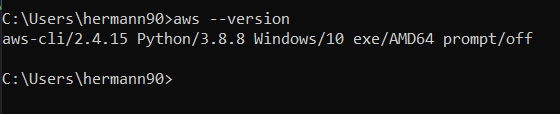

      - configuration: 
      we are now going to configure our aws account with AWS Client. you just have to enter the command aws configure, then to enter our Access Key, our Secret Key and our default region.
          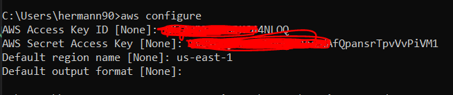

      
    ### 5.3. generate the AWS_ACCESS_KEY_ID , AWS_SECRET_ACCESS_KEY , AWS_SESSION_TOKEN using the prompt 

    If all goes well up to this level, we are ready to generate our AWS_ACCESS_KEY_ID , AWS_SECRET_ACCESS_KEY , AWS_SESSION_TOKEN for a duration of 36 hours. 

    just enter this command : 
    ### aws sts get-session-token --duration-seconds 129600 --serial-number "arn:aws:iam::XXXXXXXXXXX:mfa/hermann90" --token-code 415203
    or : 
      - __--duration-seconds 129600__ : represents the duration of the credential in seconds
      - __--serial-number__ : represents the information you can get by looking in the credentials of your IAM account.
      - __--token-code 415203__ : represents the code that your Muli Factor Authentication application generates every 30 seconds.
  
        The result of this command contains the AWS_ACCESS_KEY_ID , AWS_SECRET_ACCESS_KEY , AWS_SESSION_TOKEN informations for the configuration of the access session to our server via the __Elastic Beanstalk service__ in AWS. 

      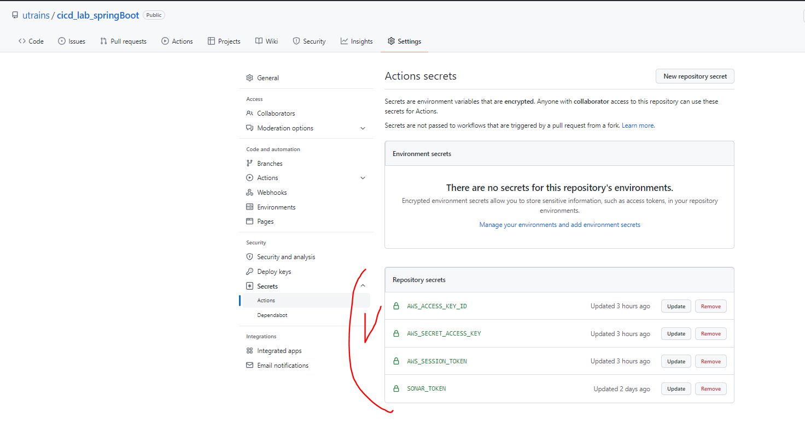


    ### Now let's use this information to finish the configuration of our github account (GitHub Secrets Actions)
      
      we must have something like this
      
 
## 6. Now let’s create the deploy job.

* this Job will allow us to retrieve the jar that we uploaded previously in our GitHub.

#### For this task, add the following code to our build.yml file

in the with section of the code below, be sure to put the name of your  __Elastic Beanstalk__ application and the __environment name__ that is created in aws.  

```
#Deploy's job
  deploy:
    #Depends on build's job
    needs: build
    name: Deploy
    #Run on Ubuntu using the latest version
    runs-on: ubuntu-latest
    steps:
      - name: Download JAR
        #Download the artifact which was uploaded in the build's job
        uses: actions/download-artifact@v2
        with:
          name: artifact
      #Deploy the artifact (JAR) into AWS Beanstalk
      - name: Deploy to EB
        uses: einaregilsson/beanstalk-deploy@v13
        with:
          aws_access_key: ${{ secrets.AWS_ACCESS_KEY_ID }}
          aws_secret_key: ${{ secrets.AWS_SECRET_ACCESS_KEY }}
          aws_session_token: ${{ secrets.AWS_SESSION_TOKEN }}
          use_existing_version_if_available: false
          application_name: spring-boot-deploy
          environment_name: Springbootdeploy-env
          version_label: ${{github.SHA}}
          region: us-east-1
          deployment_package: data-0.0.1-SNAPSHOT.jar
```
## 6. make add, commi then push the modifications

```sh
git add --all
git commit -m "CI/CD pipeline : Depoy app in aws "
git push origin main
```

- So, here, the job will download the jar file that was uploaded in the build job and deploy it to AWS EB.
- At this level, the pipeline have good configuration. 

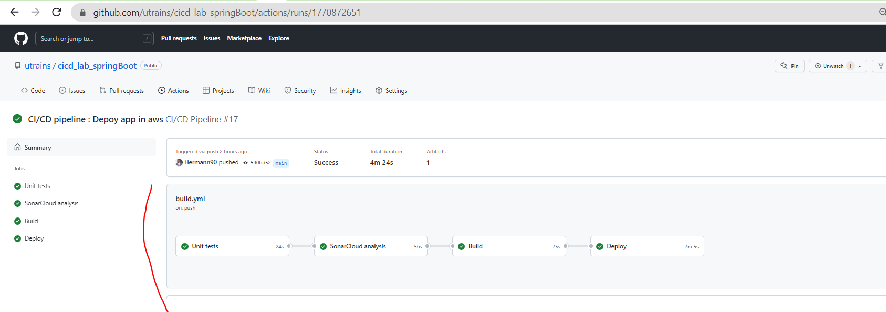

- if this step is done correctly, our application is well deployed in aws, and we can access it from the generate link in __Elastic Beanstalk__

# test the application deployment.

- when we open Elastic Beanstalk in aws, we can see that the application is well deployed. Just click on the link in 1, to open the application in another browser tab.

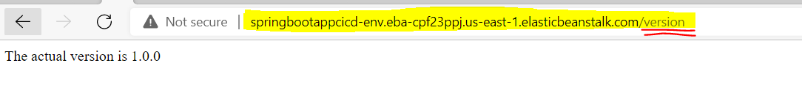

* when we open the browser, we can see the state of the application that is created for the root endpoint of our SpringBoot application. 

    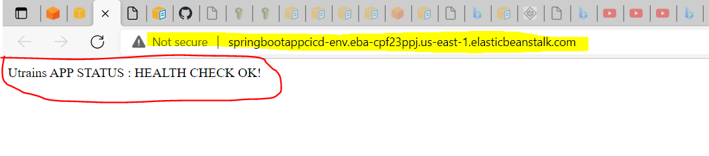

The other __Service Rest__ are written in this application as : 

  - version : to display the version of the application. (url/version)
    
    

  - currencies : to display some currency

    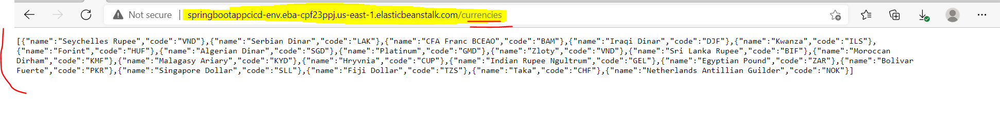

  - nations : to display the nations

      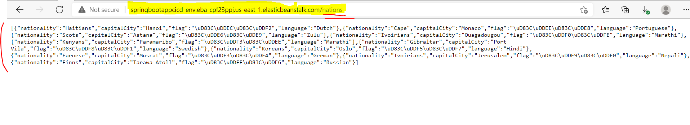

##### We see that the result of displaying the En-point is in JSON format. This is normal because we need to create a front-end that will use this Rest service to perform actions. This work will be done in another Lab. 

## If you arrive here, congratulations you have just set up a Pipeline to deploy a SpringBoot application.